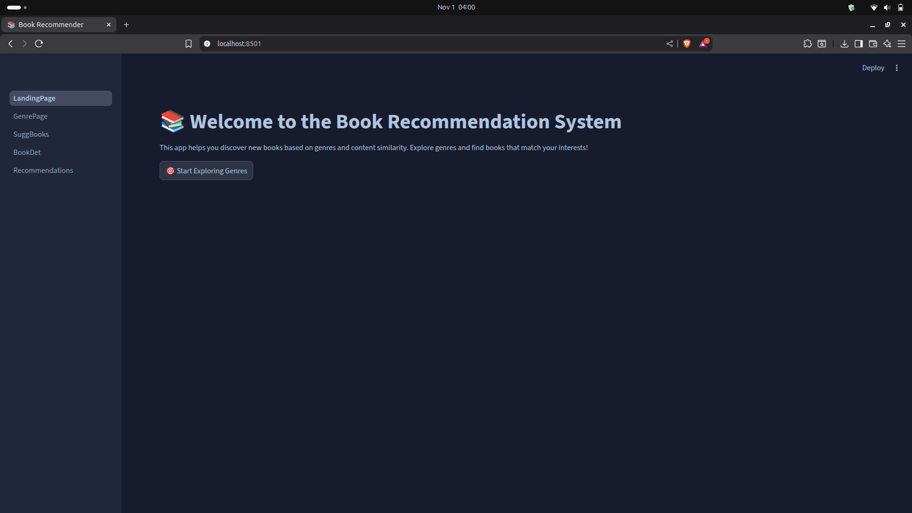
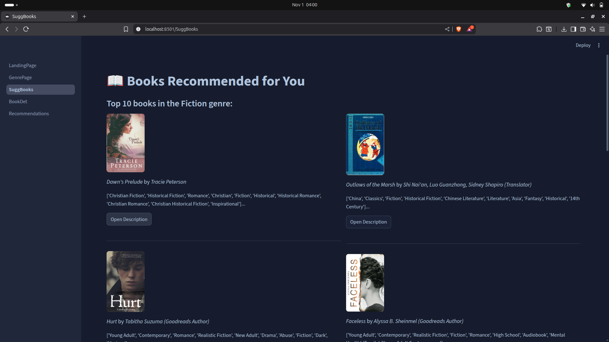
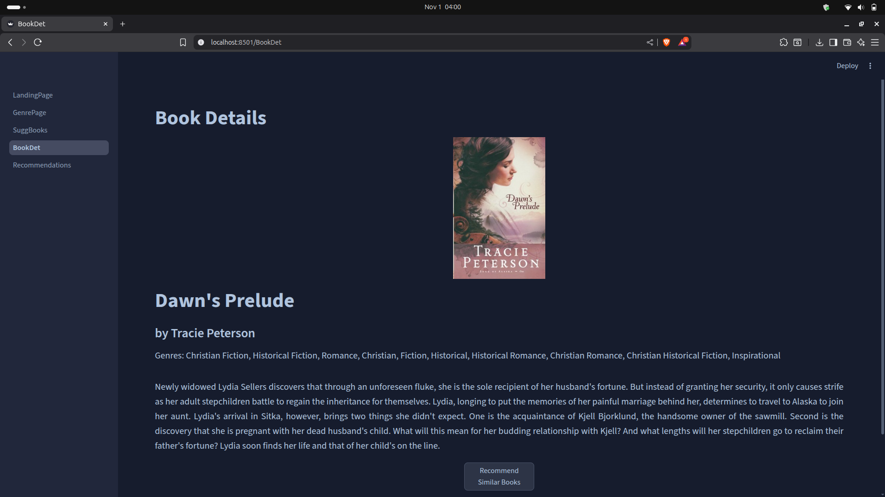
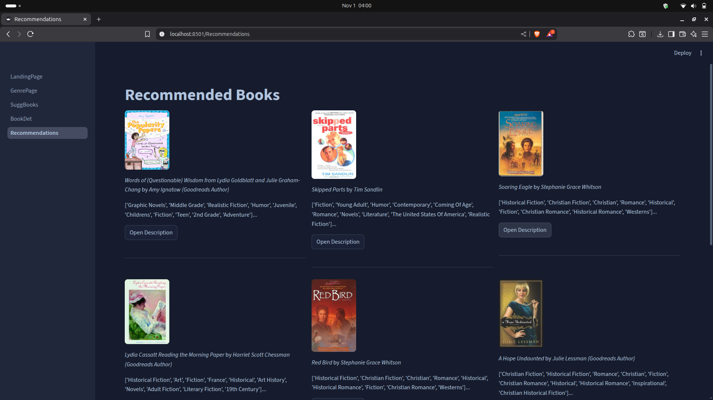

# 📚 Book Recommendation System (BRS)

A **Book Recommendation System** that suggests books to users based on their preferences, genres, and similarity with other titles.  
This project applies **Natural Language Processing (NLP)** and **Machine Learning** techniques to recommend books using text data such as titles, genres, and descriptions.

---

## 📖 Table of Contents

- [Overview](#-overview)
- [Features](#-features)
- [Tech Stack](#-tech-stack)
- [Application Pages](#-application-pages)
- [Project Structure](#-project-structure)
- [Setup Instructions](#-setup-instructions)
- [Running the Application](#-running-the-application)
- [Dataset Information](#dataset-information)
- [Model Overview](#-model-overview)
- [Future Improvements](#-future-improvements)
- [License](#-license)
- [Author](#-author)

---

## 🧠 Overview

The **Book Recommendation System (BRS)** recommends books based on user interests and genre preferences.  
It uses **TF-IDF (Term Frequency–Inverse Document Frequency)** and **Cosine Similarity** to analyze book descriptions and find the most similar titles.

The system is implemented with a **Streamlit web interface** that allows users to:

- Browse books by genre
- Get detailed information about selected books
- View personalized recommendations

---

## 🚀 Features

✅ Content-based book recommendation using TF-IDF  
✅ Genre-based filtering  
✅ Dynamic book suggestions and details  
✅ Streamlit-based interactive UI  
✅ Pre-trained model storage for fast loading  
✅ Modular code structure for easy maintenance

---

## 🧰 Tech Stack

| Category          | Tools Used                                                  |
| ----------------- | ----------------------------------------------------------- |
| **Language**      | Python 3.x                                                  |
| **Framework**     | Streamlit                                                   |
| **Libraries**     | `pandas`, `numpy`, `scikit-learn`                           |
| **Dataset**       | Custom dataset (Books_10000.csv)                            |
| **Visualization** | Streamlit components                                        |
| **Model Files**   | `.pkl` files (TF-IDF, similarity matrices, final dataframe) |

---

## 🧩 Application Pages

### 🏠 1. Home Page

Displays the project introduction, purpose, and navigation to other pages.



---

### ​🔖 2. Genre Page

Shows the top 50 most famous genres in the data used for suggestions.


---

### 📜 3. Book Suggestions

Provides 10 random book suggestions according to the genre you choose.



### 📔 4. Book Details

Displays the book details of the book you choose from the suggestions along with button to get more suggestions from the selected book.



### 📚 5. Recommendations Page

Show 6 similar recommended books from the book you initially choose from your favourite genre.



---

## 📁 Project Structure
```
.
├── .gitignore
├── .streamlit/config.toml # Streamlit app configuration
├── LandingPage.py # Main app entry point
├── downloadModel.py # Downloads model from Google Drive
├── pages/
│ ├── 1_GenrePage.py
│ ├── 2_SuggBooks.py
│ ├── 3_BookDet.py
│ └── 4_Recommendations.py
├── rawData/rawDatasetDownload.py # Script to retrieve raw data
├── recommender_Model/
│ ├── final_df.pkl # Processed book dataset
│ └── tfidf_matrices.pkl # TF-IDF vector data
└── requirements.txt # Dependencies
```
---

## ⚙️ Setup Instructions

### 1️⃣ Clone the Repository

```bash
git clone https://github.com/Aaryan10000/Book.Recommendation.System.git
cd Book.Recommendation.System
```

### 2️⃣ Create a Virtual Environment

python3 -m venv BRSenv
source BRSenv/bin/activate # Linux/macOS

# OR

BRSenv\Scripts\activate # Windows

### 3️⃣ Install Dependencies

pip install -r requirements.txt

### 4️⃣ Download Model Files

The trained similarity matrices and TF-IDF data are hosted on Google Drive (due to GitHub’s 100MB limit).
Run the following command to automatically download them:
python downloadModel.py

⚠️ This will place the .pkl model files into the recommender_Model/ folder automatically.

### ▶️ Running the Application

Start the Streamlit web app:

```bash
streamlit run LandingPage.py
```

This will launch the app in your default browser

### 🧾 Dataset Information

This project uses the “Best Books Ever” dataset, originally published on Kaggle by [mexwell](https://www.kaggle.com/mexwell).

📘 License: [Attribution-NonCommercial 4.0 International (CC BY-NC 4.0)](https://creativecommons.org/licenses/by-nc/4.0/)
📂 Dataset Source: [Kaggle - Best Books Ever](https://www.kaggle.com/datasets/mexwell/best-books-ever)

⚠️ Usage Note:
This dataset is provided strictly for research and educational purposes.
You must give appropriate credit to the original author (“mexwell” on Kaggle) and cannot use it for commercial purposes.

### 🧩 Model Overview

The model uses content-based filtering with the following pipeline:

1. Data Preprocessing → Clean and normalize book descriptions
2. TF-IDF Vectorization → Convert text to numeric representation
3. Cosine Similarity → Compute similarity between books
4. Recommendation Engine → Suggest top 10 similar books
   All processed matrices are saved as .pkl files in recommender_Model/ for faster access.

### 💡 Future Improvements

- Add collaborative filtering for user-based recommendations
- Include book cover images using an API (e.g., Google Books API)
- Integrate user login and personalized dashboards
- Deploy using Streamlit Cloud or Render
- Improve NLP model using BERT embeddings

### 🪪 License

This project is licensed under the MIT License.
You are free to use, modify, and distribute this project with attribution.

### 👨‍💻 Author

Aaryan Dawalkar
💻 B.Tech in Computer Science Engineering
[📫 Linkedin](https://www.linkedin.com/in/aaryandawalkar/)
